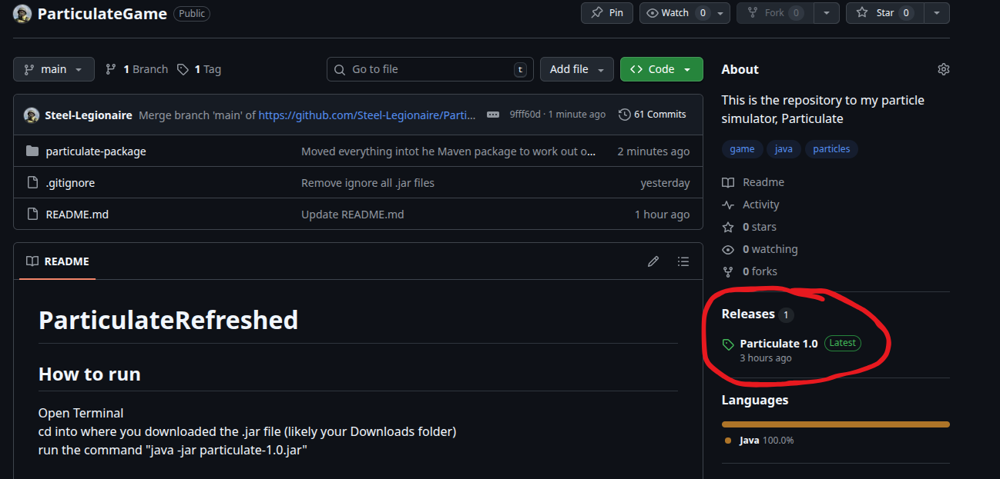
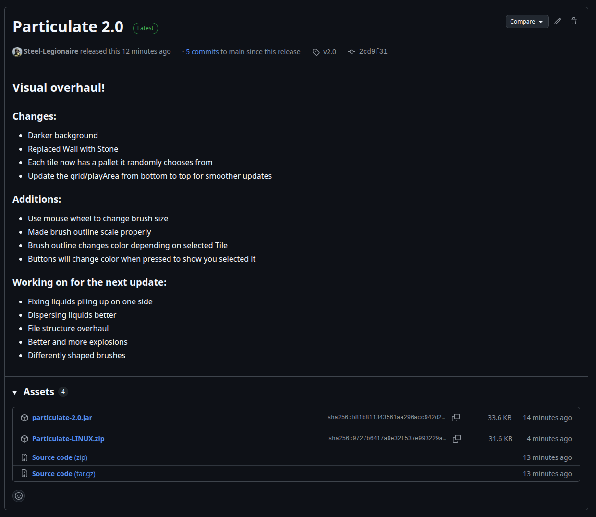
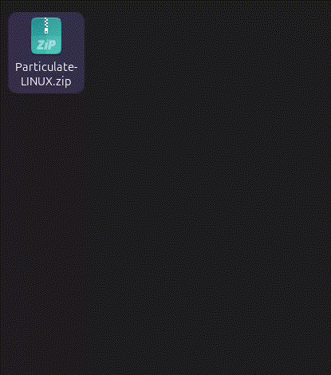
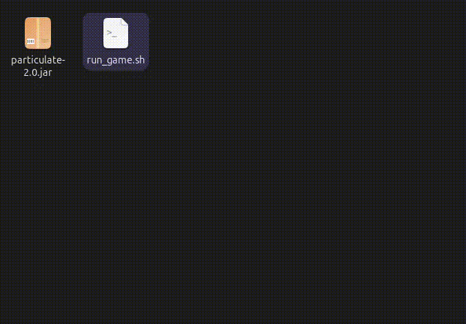

# Controls:

| Key | Action |
|-----|--------|
|R| Reset Play Area|
|Enter| Drop the floor|
|Space| Pause Game|
|Left Click| Spawn Particle|
|Middle Mouse Up| Increase Brush Size|
|Middle Mouse Down| Decrease Brush Size|
|S| Save Play Area To Desktop|
|Drag saved file to play area| Load stored play area|
|1|Select Sand|
|2|Select Water|
|3|Select Lava|
|4|Select Fire|
|5|Select Stone|
|6|Select Wood|
|7|Select TNT|
|8|Select Sand Spawner|
|9|Select Water Spawner|
|0|Select Lava Spawner|

## Requirements: 
  java: 21.0.8

## How to download the game:
  ### Click on the latest relase of Particulate under "Releases" (this will have a green box that says latest next to it)
  
  

  ### Click on "Particulate-LINUX.zip"

  

## How to run
  ### Open Files and go to your Downloads
  ### Right click on the Particulate-LINUX.zip filem then click "Extract", open the folder created

  

  ### Right click on the run_game.sh file, then click "Run As a Program" 
  
  

